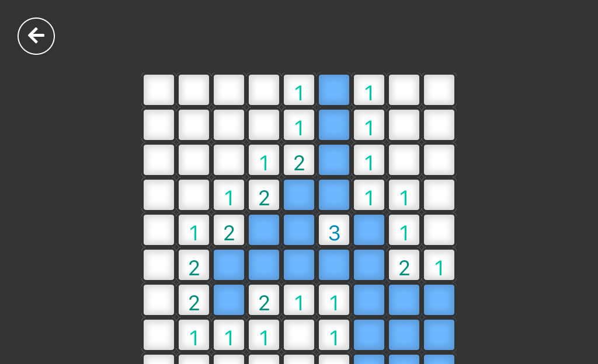

# Minesweeper

This is a Minesweeper game implementation made with [React](https://reactjs.org/) and [Redux](https://redux.js.org/).

## Screenshot



## Getting Started

## Install dependencies.

```
yarn install
```

In the project directory, you can run:

## Running the app

```
yarn start
```

Runs the app in the development mode.<br>
Open [http://localhost:3000](http://localhost:3000) to view it in the browser.

## See it running

Got to [https://carlosyslas.com/minesweeper](https://carlosyslas.com/minesweeper).
